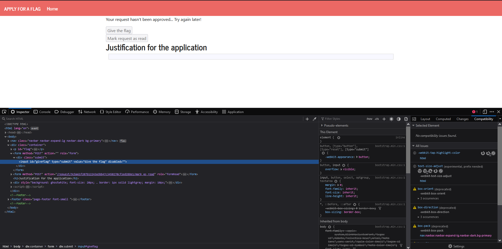
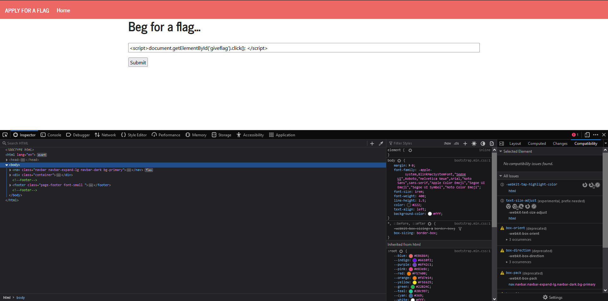
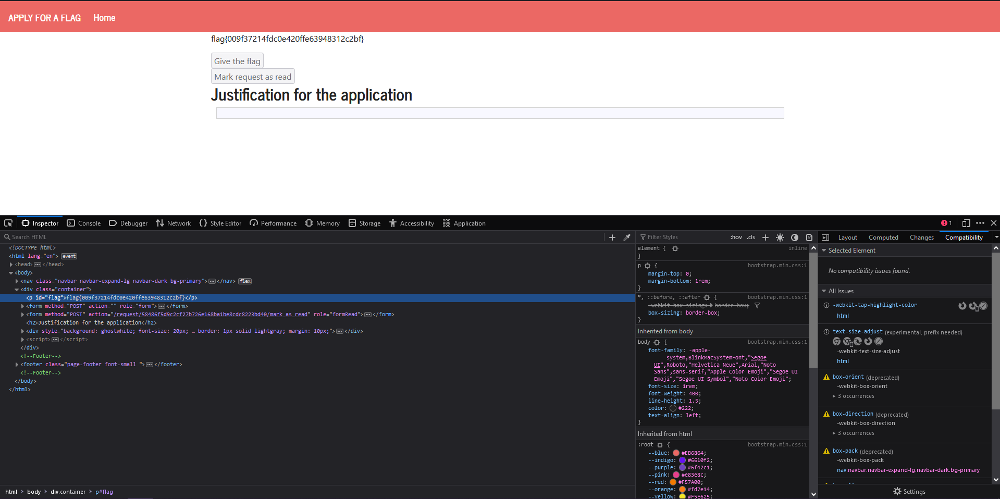
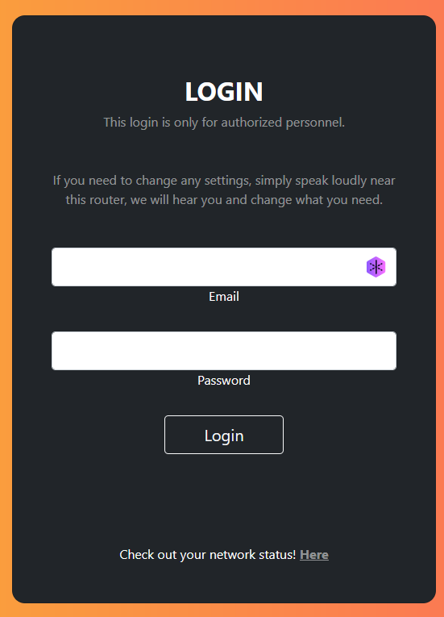
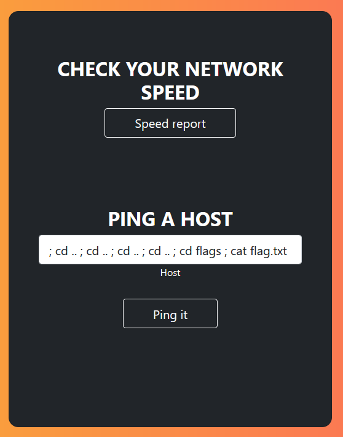
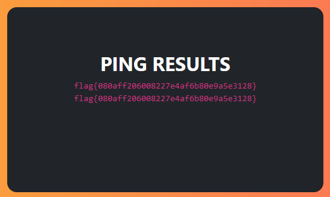

# Task 1

Logged in as Charlie with the credentials given, went to his profile and wrote the script to his description.


When going to his profile, the following popup appears:


# Task 2

In the same profile, put the following script:


Popup with cookies:


# Task 3

In the same profile, write the following script:


After this, logged out of Charlie and logged in on Alice's profile. Then visit her friend Charlie profile, and receive her cookies:


# Task 4


How a friend request is encoded.

The script used:


Alice has no friends.


After visiting Samy's profile, she now has one :).

``` Question 1 ```

Lines 1 and 2 send the token needed to authenticate the user when the request is made.

```Question 2```

No, because can only be successful because the Editor mode adds extra HTML and changes symbols.

# CTF

## Challenge 1

We have the id for the Give the flag button, we just need to access it. These buttons are only enbaled to the admin so our purpose is to make the admin click the button Give the flag for us. 



We use the following JavaScript to click the button with that id: `<script>document.getElementById('giveflag').click(); </script>`



We got the flag!



## Challenge 2

Since we don't have credentials, we have to find a way to retrieve the flag.



When a user submits a user request, the system uses the ping command to send packets to the host. Which gives us access to various commands and allows us to exploit them. Using the `;` allows to inject different commands and access information which we wouldn't be able to access.



We got the flag!


