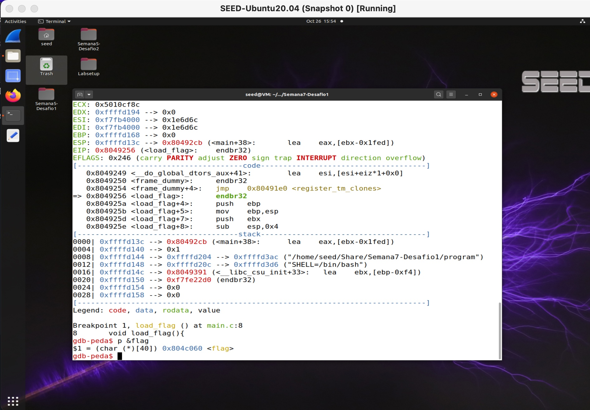
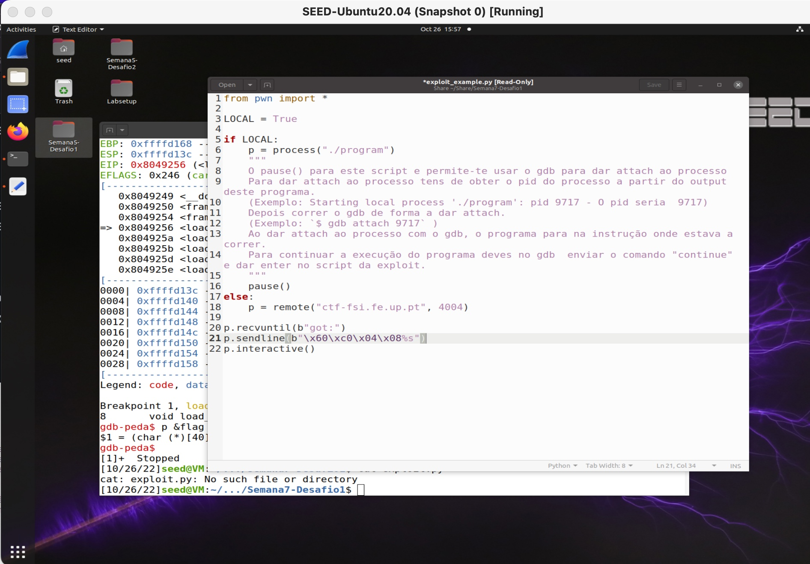
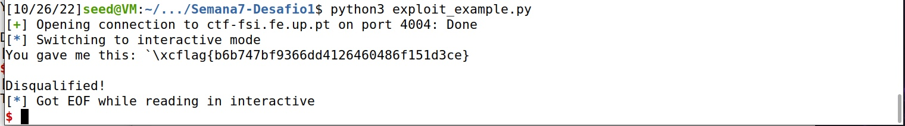
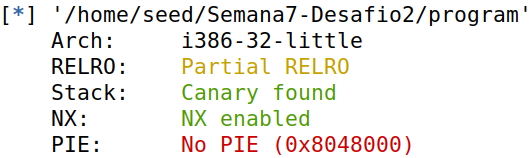
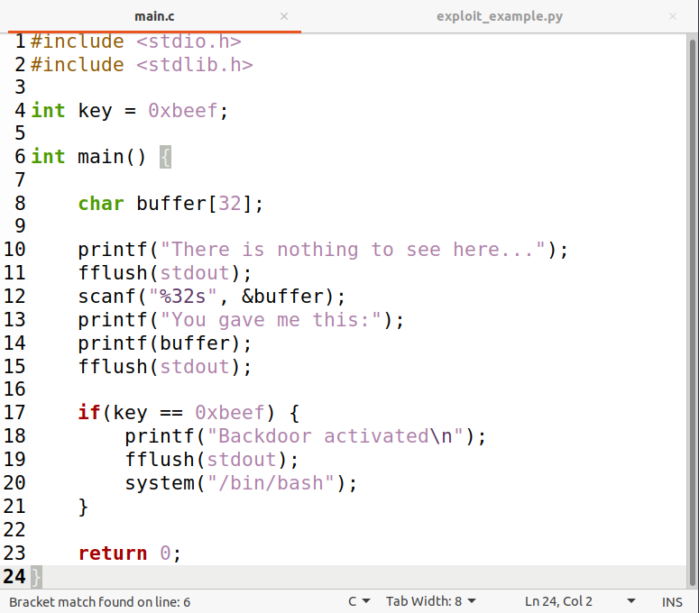
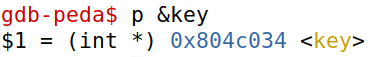
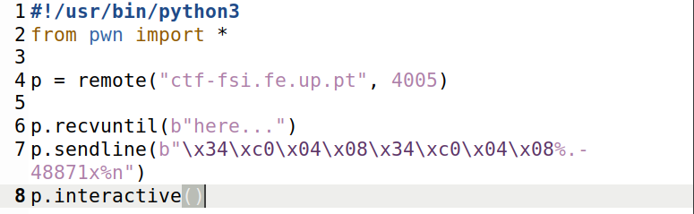
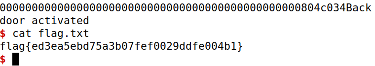

# Task 1

```python
#!/usr/bin/python3
import sys

# Initialize the content array
N = 1500
content = bytearray(0x0 for i in range(N))

for i in range(0, N, 2):
  content[i:i+2] = ("%s").encode('latin-1')

# Write the content to badfile
with open('badfile', 'wb') as f:
  f.write(content)
```

We used this generator of %s to get an input in order to overflow the myprintf() function.


Overflowed the server.

# Task 2

# CTF

# Desafio 1

We analysed the main.c file with `checksec`, we found that the flag was a global variable. As such, we used gdb to check its address.


The memory address where we can find the flag.


The script used. In line 21 are the values we found in the gdb in little endian.


Got the flag!

# Desafio 2
We analysed the program file with `checksec` and found that there is no PIE, so the virtual memory it's kept static.


While analysing the main.c code, we can conclude that if key attribute equals 0xbeef, then we can open the shell. So we altered the key's value.


Just like the last challenge, we run gdb and execute `p &key`, in order to know where the variable is located.


As we know where the key is located and that 0xbeef = 48879, we already wrote 8 characters, so it just leave us with 48879-8=48871


By executing the python code, we are able to open the backdoor and retreive the flag.

Got the flag!
