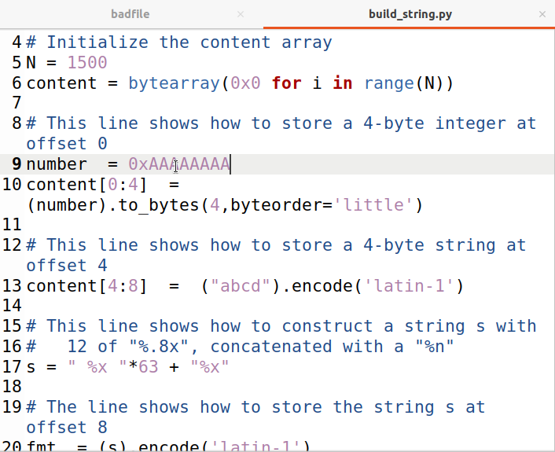
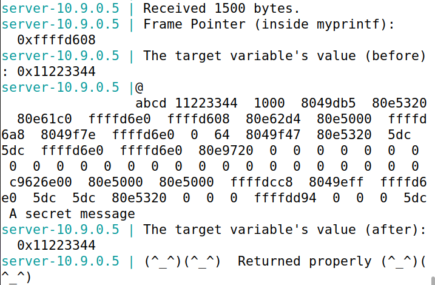
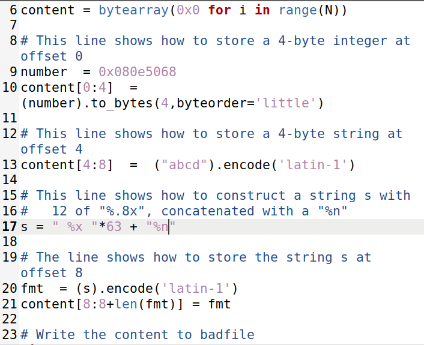

# Task 1

```python
#!/usr/bin/python3
import sys

# Initialize the content array
N = 1500
content = bytearray(0x0 for i in range(N))

for i in range(0, N, 2):
  content[i:i+2] = ("%s").encode('latin-1')

# Write the content to badfile
with open('badfile', 'wb') as f:
  f.write(content)
```

We used this generator of %s to get an input in order to overflow the myprintf() function.


Overflowed the server.

# Task 2

## Task 2.A

We used the `build_string.py` to have access to all the data on the stack.

In order to that, we changed the amount of "%x" to 64 for the server to output the number of our input.

In this case, we printed 0xAAAAAAAA.




We can see at the end of the server output the string we used.


## Task 2.A

In order to have access to the secret message, we changed the number to the secret message address and the last value of the output is now a `%s`.


At the of the output, the secret message was written.



# Task 3

## Task 3.A

In order to change the target variable to another value, we must change the number to the target address and the value output is now a `%n`.



At the of the output, a different target value was written.


## Task 3.B

In order to change the target value to 0x00005000, we must change the value that is output to match 0x00005000(20480).


By changing the value to `"%322x"*63 + "a%n"*60` and it gave us the wanted output.


# CTF

# Desafio 1

We analysed the main.c file with `checksec`, we found that the flag was a global variable. As such, we used gdb to check its address.


The memory address where we can find the flag.


The script used. In line 21 are the values we found in the gdb in little endian.


Got the flag!

# Desafio 2
We analysed the program file with `checksec` and found that there is no PIE, so the virtual memory it's kept static.


While analysing the main.c code, we can conclude that if key attribute equals 0xbeef, then we can open the shell. So we altered the key's value.


Just like the last challenge, we run gdb and execute `p &key`, in order to know where the variable is located.


As we know where the key is located and that 0xbeef = 48879, we already wrote 8 characters, so it just leave us with 48879-8=48871


By executing the python code, we are able to open the backdoor and retreive the flag.

Got the flag!
