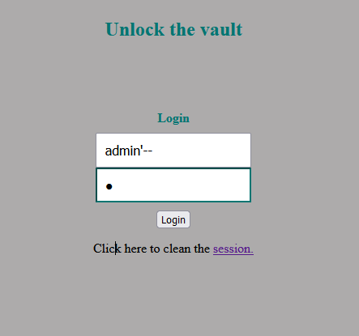

# Task 1


After setting up server, used this query to get Alice data.

# Task 2.1


With this input we were able to gain access to the admin profile. This works because we're closing the login string and commentig the rest of the code.

# Task 2.2

Using ```curl 'www.seed-server.com/unsafe_home.php?username=admin%27%23&Password=' ``` we were able to get the HTML page of the admin profile.


# Task 2.3

Although we could in theory put any SQL command between ```' ``` and ``` # ```, that's not possible.


This happens because the ```query```function in PHP allows only one query at a time.

# Task 3.1


We can go to the NickName field in the Edit Profile page and input the query above, which will increase Alice's salary.


# Task 3.2


To decrease Boby's salary, we just need to input the query above in any field.


# Task 3.3


password hash

using the query ``` ', Password = "5baa61e4c9b93f3f0682250b6cf8331b7ee68fd8" where Name= "Boby" # ```, we were able to change Boby's password


Changed password


Gained access

# CTF

## Desafio 1

With the following input, we could login as admin.



## Desafio 2

